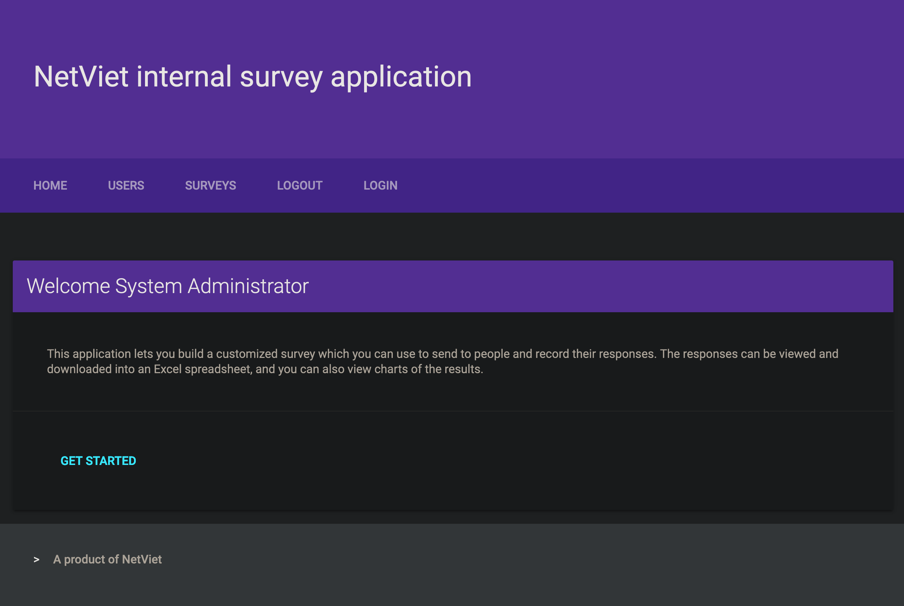

# php-survey-builder

*php-survey-builder* is a PHP web application that lets you create surveys and collect survey responses. The results can be viewed on charts and exported to CSV. The survey data is stored within a sqlite3 database by default, and can also be stored in a mysql or postgresql database.  Edit config/Database.ini to use mysql or postgresql.

## Default login

The default login is 'admin' with a password of '12345'. You can add and remove logins from the Users tab.

## Quick Start
```sh
git clone https://github.com/thanhphu/php-survey-builder.git
cd php-survey-builder
php -S localhost:8080
```

## Troubleshooting

Be sure that your data/ directory is writable by your web server.

## Changes in this fork
This project was forked from [phpdave11](https://github.com/phpdave11/php-survey-builder) with the following improvements
* Add material design for user-facing pages
* Add appropriate ignore to avoid leaking credentials on source control
* Add default user ID you can set via GET parameter when sending out mass email
* Stricter .htaccess
* More readable fonts

## Screenshots


Login page


Welcome page


Survey management page


Survey page